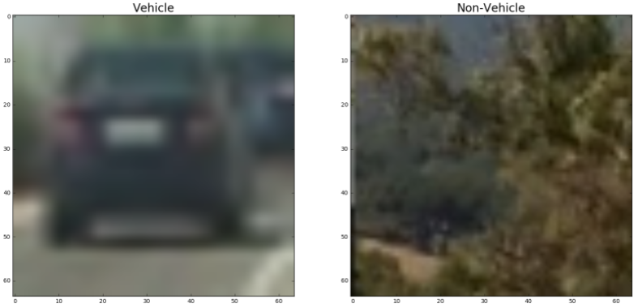
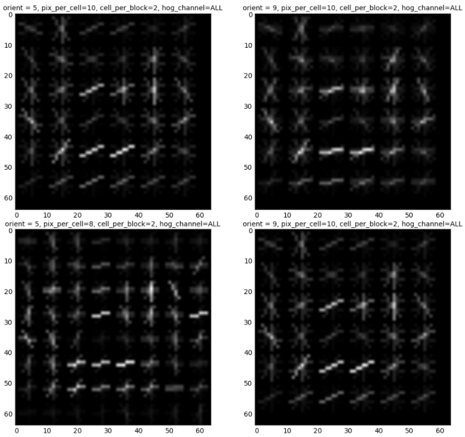
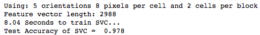
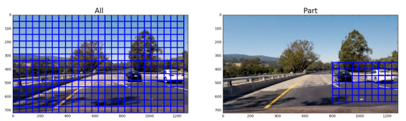
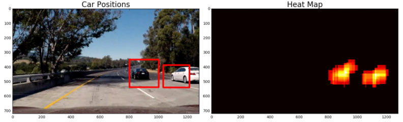
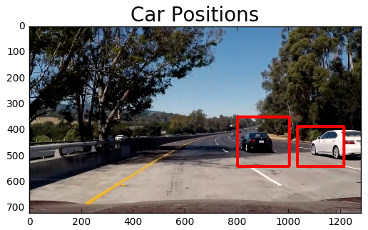

# Vehicle Detection

## Overview
* Folder report/: contains images for the report
* README.md: Project Description
* P5-vehicle-detection.ipynb: contains the code for the project

## Project
The goal of the project is to write a software pipeline which can draw bounding boxes around vehicles in a video. 

The following topics are described in this README:

1. Histogram of Oridented Gradients (HOG)
2. Sliding Window Search
3. Video Implementation 

The steps of this project are the following:

* Perform a Histogram of Oriented Gradients (HOG) feature extraction on a labeled training set of images and train a classifier Linear SVM classifier
* Estimate a bounding box for vehicles detected.

Here are links to the labeled data for [vehicle](https://s3.amazonaws.com/udacity-sdc/Vehicle_Tracking/vehicles.zip) and [non-vehicle](https://s3.amazonaws.com/udacity-sdc/Vehicle_Tracking/non-vehicles.zip) examples to train your classifier.  These example images come from a combination of the [GTI vehicle image database](http://www.gti.ssr.upm.es/data/Vehicle_database.html), the [KITTI vision benchmark suite](http://www.cvlibs.net/datasets/kitti/), and examples extracted from the project video itself.   You are welcome and encouraged to take advantage of the recently released [Udacity labeled dataset](https://github.com/udacity/self-driving-car/tree/master/annotations) to augment your training data.  

---

# 1. Histogram of Oriented Gradients (HOG)

The code of this chapter can be found in notebook at the section *1. Feature Extraction* and *2. Vehicle Classification*.

####1. In the first step I started by reading in all the `vehicle` and `non-vehicle` images.  Here is an example of one of each of the `vehicle` and `non-vehicle` classes:

####2. In the second step I extracted the HOG features by using the method [`skimage.feature.hog()`](http://scikit-image.org/docs/dev/api/skimage.feature.html#skimage.feature.hog). You can find my implementation in the [notebook](P5-vehicle-detection.ipynb) by searching for the following method `get_hog_features(img, orient, pix_per_cell, cell_per_block,vis=False, feature_vec=True)`

I then explored different color spaces and different `skimage.hog()` parameters (`orientations`, `pixels_per_cell`, and `cells_per_block`).  I grabbed random images from each of the two classes and displayed them to get a feel for what the `skimage.hog()` output looks like. Here are some examples of using different 

I tried various combinations of parameters and color spaces. I had the best results with the following parameters `color_space=HSV`,
`orient=5`, `pix_per_cell=8`, `cell_per_block=2` and `hog_channel=ALL`

####3. Support Vector Machine (SVM) Classifier
I trained a linear SVM using a combination of HOG features and color (histogram) features. I normalised the data with the [`sklearn.preprocessing.StandardScaler`](http://scikit-learn.org/stable/modules/generated/sklearn.preprocessing.StandardScaler.html). Before training the classifier I split the data into 80% training and 20% testing. The image shows a short sum up of the training and testing.

###Sliding Window Search

The whole code of this chapter can be found in notebook at the section *Sliding Window Search*.

####1. Implementation of sliding window

1. I decided to implement the method  `slide_window`
    * The function will slide through an image with an given window size and extract information. 
    * I decided to set a start and end point for x and y, because for the video we know on which side new cars are coming. The image shows the difference.
    

2. The next step is to classify the *windows*. I implemented this in the method `search_windows`
    1. It extracts the features of the images.
    2. The trained SVM classifies the window based on the image. If the window is classified as an car, the window will be added to the box.
    
3. The second step does not classify very successful. So I use different scales of the image and classify the windows for each scale. This will result in more boxes, because the disadvantage of the method described in the second method only works if the car is in the perfect window. I implemented this in the method `find_cars`.
    1. The second step is executed multiple times for different image scales. 
    2. We will probably receive more correctly classified windows
    3. The window will be drawn in a heatmap
    4. We will filter the boxes of the heatmap which occur less than the given threshold. The result can be seen as following:

    

####2. Show some examples of test images to demonstrate how your pipeline is working.  What did you do to optimize the performance of your classifier?

Ultimately I searched on two scales using HSV 3-channel HOG features plus histograms of color in the feature vector, which provided a nice result. 

---

### Video Implementation

The whole code of this chapter can be found in notebook at the section *Video - Implementation*.

####1. Provide a link to your final video output.  Your pipeline should perform reasonably well on the entire project video (somewhat wobbly or unstable bounding boxes are ok as long as you are identifying the vehicles most of the time with minimal false positives.)
Here's a  [project video](https://youtu.be/9jJKFtFYVJI)

####2. Describe how (and identify where in your code) you implemented some kind of filter for false positives and some method for combining overlapping bounding boxes.

The code for this part can be seen in the notebook at the section *Heatmap* (method=`heatmap`). 

In a nutshell, based on the box list a heat map will be created. I recorded the positions of positive detections in each frame of the video.  From the positive detections I created a heatmap and then thresholded that map to identify vehicle positions.  I then used `scipy.ndimage.measurements.label()` to identify individual blobs in the heatmap.  I then assumed each blob corresponded to a vehicle.  I constructed bounding boxes to cover the area of each blob detected.  

Prerequisite: a box list which was detected by the implementation of sliding window search

1. In the first step, the algorithm iterates through the boxes of the box list and adds +1 to the region of the box
2. The algorithm filters out the regions which are below the threshold heat and sets them to zero.
3. The boxes are created through the left over heat regions and drawn to the image.

Here's an example result showing the heatmap from a series of frames of video, the result of `scipy.ndimage.measurements.label()` and the bounding boxes then overlaid on the last frame of video:

### Some Examples

![Examples with heat map][report/6_examples.png]

---

###Discussion

####1. Briefly discuss any problems / issues you faced in your implementation of this project.  Where will your pipeline likely fail?  What could you do to make it more robust?

Here I'll talk about the approach I took, what techniques I used, what worked and why, where the pipeline might fail and how I might improve it if I were going to pursue this project further.  

I used a simple trick for doing a better job at classifing the vehicle by setting a start/end point for x and y. This will cause a lot of trouble if the car drive on the right lane for example. The current pipeline will not work if the vehicle are not on the right side of the car. 

The pipeline will also fail if there is a truck, because there are no images provided for the trucks.

A simple improvement would be to change the threshold of the heat map, because at the moment the detected vehicle areas are very huge.

An other improvement would be to change the svm to a neural network and train it on the database.

